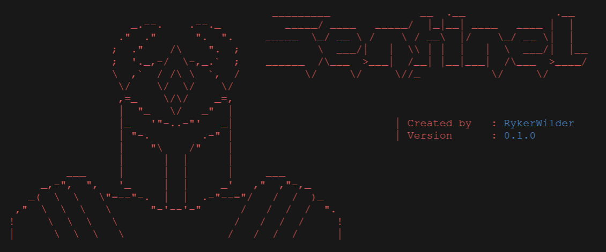
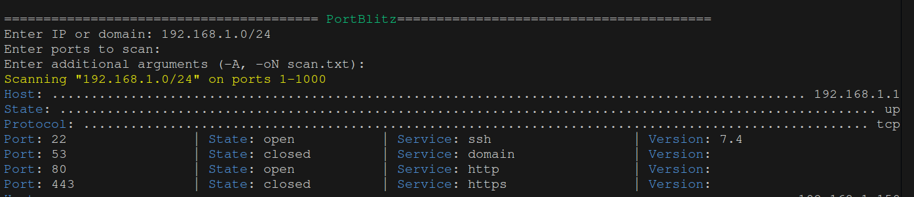
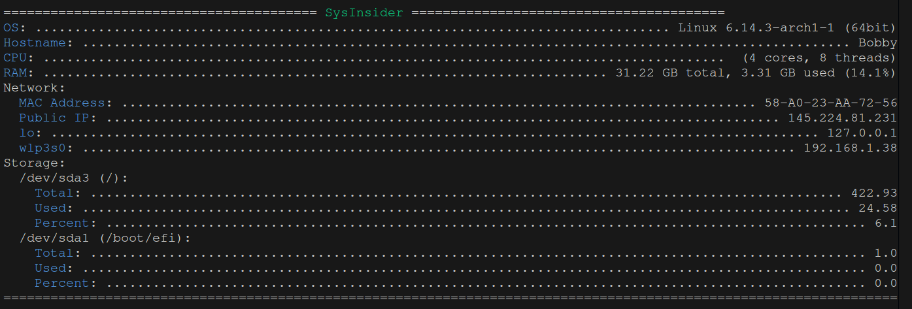

# Sentinel
Sentinel is a Swiss Army knife for cybersecurity, we try to keep it updated and add new features all the time.

---

**Please note**, only tools are present in the menu, to see all the other commands on sentinel, scroll down to [commands](#commands).

## Menu

#### 1. PortBlitz
is a Python tool designed to perform port scans in a simple and intuitive way, using the power of Nmap. With a user-friendly interface and colorful results, it's perfect for beginners and experts alike. You must have nmap installed on your computer for it to work properly.

#### 2. SysInsider
is a Python program designed to collect and display detailed information about the system on which it runs. It is useful for diagnosing hardware/software issues, monitoring system resources, or simply getting a comprehensive report of computer specifications. SysInsider reports system data such as OS, RAM usage, CPU information, all disk partitions and their space, network information such as public, private, and MAC address.

#### 3. IPGlobeTracker
is a Python program that extends the functionality of SysInsider to provide detailed information about public IP addresses and domains. Use the [ip-api.com](https://ip-api.com/) public API to get geographic data, ISPs, and other useful information.

## Commands

| Key         | Action              | Description                                |
|------------ |---------------------|--------------------------------------------|
| `+`         | Open new window     | Open new terminal window                   |
| `Esc`       | Leave Sentinel      | Program execution block                    |